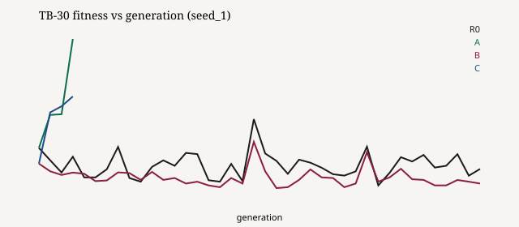
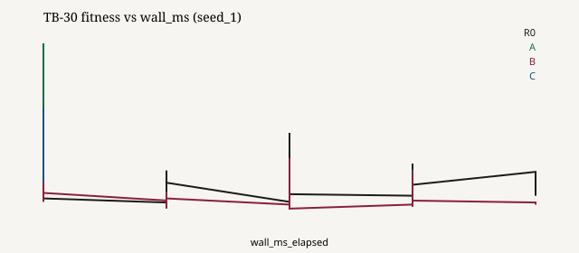
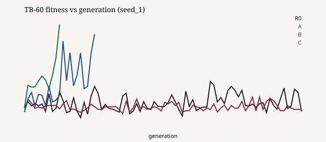
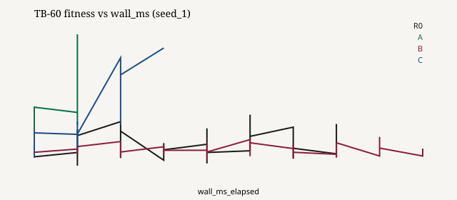

# EvoGen Benchmark Report — Trait Forge Arena (v1)

> **Status:** Research PoC v1 narrative complete (smoke protocol **R=2**).  
> **Not a publication claim:** numbers are seed-limited; re-run with R=10 before strong inference.  
> **Raw runs:** `results/survival/<bench>/<technique>/seed_<n>/` (gitignored).  
> **Aggregates:** [survival-benchmark-summary.md](survival-benchmark-summary.md), [curves/](curves/).

## 1. Intro

EvoGen asks whether combining **genetic reproduction**, **direct (intra-lifetime) learning**, and **environmental selection** develops a species faster under equal time/generation budgets than genetic-only, direct-only, or random baselines.

This report answers that question on **T2 Trait Forge Arena** timed benches (phase 08), not on marketing demos. Claims below cite run paths or the published aggregate.

## 2. Related work (pointers only)

| Topic | Canonical pointer | Use here |
|-------|-------------------|----------|
| Baldwin effect | Hinton & Nowlan, 1987 (classic EC literature) | Frame H3 as pattern, not proof |
| Genetic algorithms | Goldberg / Mitchell textbook baselines | Technique A / A+ |
| Local / Hebbian updates | Standard one-step local rules | DirectLearner in B / C / C-L |

No fabricated DOIs. Human reviewers should confirm edition/year before external citation. Phase sources: `.local/phases/09-benchmark-report/OFFICIAL-REFERENCE.md`.

## 3. Methods — Trait Forge Arena

| Rules (fixed) | Variables (bench JSON) |
|---------------|------------------------|
| Bounds; death at energy ≤ 0 | `grid_w/h=16`, food/hazard/drain, `episode_ticks=32` |
| Discrete 5-way actions from response bins | Season stimulus; flip on drift benches |
| Reward: Δenergy + small alive bonus | Population 20, `genome_size=8` |

Protocol: stop on first of τ (`fitness_threshold`), `max_wall_ms`, or `max_generations`. See [EXPERIMENTAL-DESIGN.md](../EXPERIMENTAL-DESIGN.md).

**ADR-1 action set:** 5-way N/E/S/W/stay from scalar bins (locked phase 06).  
**ADR-2 τ:** τ_mild=−0.40, τ_med=−0.60, τ_harsh=−0.68 (calibration smoke, technique C, seed 42).  
**ADR-3 techniques:** R0/A/B/C/C-L/A+ flag matrix via `apply_technique_defaults`.

## 4. Techniques

| ID | Genetic | Direct | Inheritance | Elite |
|----|---------|--------|-------------|-------|
| R0 | no | no | Darwinian | 1 |
| A | yes | no | Darwinian | 1 |
| B | no | yes | Darwinian | 1 |
| C | yes | yes | Darwinian | 1 |
| C-L | yes | yes | Lamarckian | 1 |
| A+ | yes | no | Darwinian | 5 |

## 5. Timed protocol (this report)

| Bench | Budget | τ | Drift | Seeds |
|-------|--------|---|-------|-------|
| TB-30 | 30s / 40 gens | −0.40 | no | 1..2 |
| TB-60 | 60s / 80 gens | −0.60 | no | 1..2 |
| TB-120 | 120s / 150 gens | −0.68 | @ gen 75 | 1..2 |
| TB-DRIFT | 90s / 100 gens | −0.55 | @ gen 50 | 1..2 |

Full table: [survival-benchmark-summary.md](survival-benchmark-summary.md).

## 6. Results

### 6.1 TB-30 (mild) — who reaches τ?

| Technique | Seeds hitting τ | Example run paths |
|-----------|-----------------|-------------------|
| R0 | 0/2 | `results/survival/TB-30/R0/seed_1/`, `results/survival/TB-30/R0/seed_2/` |
| A | 2/2 | `results/survival/TB-30/A/seed_1/` (4 gens), `results/survival/TB-30/A/seed_2/` (37 gens) |
| B | 0/2 | `results/survival/TB-30/B/seed_1/`, `results/survival/TB-30/B/seed_2/` |
| C | 2/2 | `results/survival/TB-30/C/seed_1/` (4 gens), `results/survival/TB-30/C/seed_2/` (12 gens) |
| C-L | 0/2 | `results/survival/TB-30/C-L/seed_1/`, `results/survival/TB-30/C-L/seed_2/` |
| A+ | 2/2 | `results/survival/TB-30/A+/seed_1/` (3 gens), `results/survival/TB-30/A+/seed_2/` (9 gens) |

Aggregate medians: [survival-benchmark-summary.md](survival-benchmark-summary.md) rows TB-30.

### 6.2 TB-60 (medium) — does C beat A / B / R0?

| Technique | Seeds hitting τ | Hit generation(s) | Final fitness@budget (seed_1 / seed_2) |
|-----------|-----------------|-------------------|----------------------------------------|
| R0 | **0/2** | — | −0.8120 / −0.7840 |
| A | **1/2** | seed_1 @ gen 10 | −0.5655 / −0.7960 |
| B | **0/2** | — | −0.8065 / −0.7905 |
| C | **2/2** | gen 20 / gen 58 | −0.5930 / −0.5475 |
| C-L | **0/2** | — | −0.8055 / −0.7910 |
| A+ | **2/2** | gen 9 / gen 30 | −0.5755 / −0.5600 |

**Paths (examples):** `results/survival/TB-60/C/seed_1/`, `results/survival/TB-60/A/seed_1/`, `results/survival/TB-60/R0/seed_1/`, `results/survival/TB-60/B/seed_1/`.

**Answer (smoke, tentative):** Under TB-60, **C beats R0 and B** (2/2 τ hits vs 0/2). Versus **A**, C is **more reliable** (2/2 vs 1/2); A's successful seed was faster (gen 10 vs C's gen 20 on seed_1), but A failed seed_2. **A+** also hit 2/2 (strong elitism, genetic-only).

### 6.3 TB-120 (harsh + mid drift)

No technique reached τ_harsh (−0.68) within 150 gens (all `stop_reason=max_generations`). Drift logged at `drift_at_gen=75` (e.g. `results/survival/TB-120/C/seed_1/meta.json`). Best mean fitness stayed below τ for all listed techniques; finals ≈ −0.82…−0.86 (summary table).

### 6.4 TB-DRIFT — recovery lag

| Technique | Reached τ before drift? | `drift_at_gen` | Recovery lag |
|-----------|-------------------------|----------------|--------------|
| R0, B, C-L | no (full 100 gens) | 50 | not recovered to 90% pre-drift (`—` in summary) |
| A, C, A+ | yes (early `fitness_threshold`) | −1 (flip never applied) | n/a — run ended before flip |

Example early C stop: `results/survival/TB-DRIFT/C/seed_1/` (`generations_run=10`).  
Example full R0 with flip: `results/survival/TB-DRIFT/R0/seed_1/` (`drift_at_gen=50`).

**H2 (smoke):** recovery-lag comparison C vs A is **not identified** here — both exited on τ before the flip. R0/B/C-L experienced drift but did not recover.

### 6.5 Learning curves

Seed_1 curves for R0/A/B/C:

| Bench | Fitness vs generation | Fitness vs wall_ms | CSV |
|-------|----------------------|--------------------|-----|
| TB-30 |  |  | `curves/TB-30_*_seed1.csv` |
| TB-60 |  |  | `curves/TB-60_*_seed1.csv` |

Source metrics: `results/survival/TB-30/R0/seed_1/metrics.jsonl`, `results/survival/TB-30/A/seed_1/metrics.jsonl`, `results/survival/TB-30/B/seed_1/metrics.jsonl`, `results/survival/TB-30/C/seed_1/metrics.jsonl`, and the TB-60 seed_1 analogues under `results/survival/TB-60/{R0,A,B,C}/seed_1/`.

## 7. Research questions → results

### RQ1 — Darwinian vs Lamarckian (`C` vs `C-L`)

On TB-30/TB-60 smoke, **C** hit τ; **C-L** did not (0/2). Paths: `results/survival/TB-30/C-L/seed_1/`, `results/survival/TB-30/C-L/seed_2/`, `results/survival/TB-60/C-L/seed_1/`, `results/survival/TB-60/C-L/seed_2/`.  
**Tentative:** Lamarckian inheritance did **not** help under these arena knobs / R=2. Not a final answer on RQ1.

### RQ2 — Evolved `learning_rate` / `mutation_rate`

TB-30 technique C: `learning_rate_mean` fell slightly as fitness rose  
- seed_1: lr 0.01000 → 0.00961, fitness −0.6565 → −0.3825 (`results/survival/TB-30/C/seed_1/metrics.jsonl`)  
- seed_2: lr 0.01000 → 0.00886, fitness −0.6800 → −0.3155 (`results/survival/TB-30/C/seed_2/metrics.jsonl`)  

Compatible with a weak Baldwin-style **pattern** (H3); not causal proof. Oscillation / meta-optimum needs longer R=10 series.

### RQ3 — Static vs drift: where does C beat A/B?

- **Static mild/medium (TB-30/60):** C clearly beats R0/B on τ-hit rate; mixed vs A (reliability edge to C).  
- **Drift benches:** C often wins by hitting τ **before** stress; post-flip recovery not measured for C/A on this smoke. Harsh TB-120: no technique beats τ — C does not “clearly” dominate finals.

### RQ4 — Population vs compute

Not swept in phase 09 (fixed pop=20). Deferred.

## 8. Narrative — species under scarcity

In the mild arena, random walkers (R0) and lifelong learners without inheritance of success via selection (B) stay hungry: mean fitness remains poor across the budget. Selection on genomes (A, A+) can invent better foraging biases; adding a little lifetime correction (C) often reaches the survival threshold on **both** short seeds. When the world turns harsh or flips mid-run, the same budgets may be too small for anyone — the species does not “understand” the season; it only samples policies under energy drain. That limit is the point of equal-budget comparison, not a story about intention.

## 9. Discussion

- Genetic selection is necessary here; direct-only (B) matches R0 failure modes on TB-30/60.  
- Full system C is competitive; A+ shows elitism alone can also hit τ on medium scarcity.  
- C-L underperformed C in this smoke — treat as a prompt for RQ1, not a verdict.  
- Wall-clock on this machine is tiny vs generation caps; generation budget dominated stops.

## 10. Limits

1. **R=2** only — high seed variance (see A on TB-60).  
2. Recovery lag undefined when τ stops the run before drift.  
3. τ_harsh may be too strict for current arena/reward scale (TB-120 all fail).  
4. No population-size sweep (RQ4).  
5. Live UI screenshots optional / local — not embedded.

## 11. Sign-off checklist

- [x] Outline sections present  
- [x] RQ → results mapped  
- [x] ADR notes (action set, τ, techniques)  
- [x] Numeric claims footnoted to run paths or aggregate  
- [x] Curves exported under `docs/results/curves/`  
- [ ] Human spot-check of citations / thresholds before external publication  

**PoC v1 (survival-benchmark narrative):** complete for internal roadmap. Next work = R=10 full matrix and/or τ recalibration if TB-120 should be discriminative.
