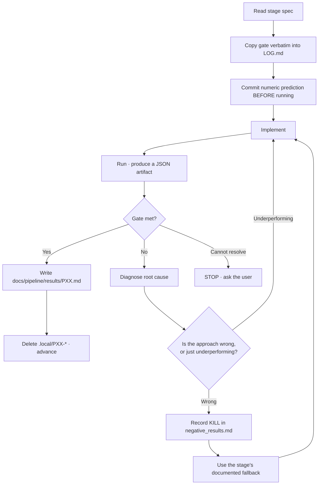

# P19 — Agent operating protocol

> **Applies always. Read this before doing anything else in this repository.**
> This file is not a stage. It is the rulebook that governs every stage.

---

## 1. If you read only one section, read this

You are working on a project that already failed once, in a specific and
well-documented way. The failure was **not** insufficient effort — 341,926 lines
of code and 564 commits were produced. The failure was that **none of that work
was ever checked against a number that could go down.**

Your single most important job is to make measurements that can report bad news,
and then to obey them.

**The three rules that would have prevented the entire failure:**

1. **If you did not spend GPU time, you did not make progress.** Writing documents is overhead.
2. **If a number has no committed JSON artifact behind it, it is not a number.** It is a claim, and claims are worthless here.
3. **If a gate fails, stop.** Do not weaken the gate. Do not route around it. Do not open a new workstream. Fix the cause.

---

## 2. Start-of-session procedure

Follow this exactly, every session, before doing anything else.

### Step 1 — Find out where the project is

```bash
ls docs/pipeline/results/
```

The highest-numbered `PXX.md` present is the **last completed stage**. The next
stage is your work. There is no ambiguity and no judgement call.

```bash
ls .local/
```

If a `PXX-*` directory exists, that stage is **in flight**. Read its `LOG.md` and
continue from its handoff note. If two exist, the protocol was violated: close
the older one first.

### Step 2 — Read exactly four documents

| Order | Document | Why |
|---|---|---|
| 1 | This file | The rules |
| 2 | [`docs/ASSESSMENT-2026-07-30.md`](../ASSESSMENT-2026-07-30.md) | What went wrong, and why the rules exist |
| 3 | [`docs/pipeline/README.md`](README.md) | The objective and the stage index |
| 4 | `docs/pipeline/PXX-*.md` for **your** stage | Your actual task |

**Do not read the other stage files.** The wave history — 573 reports and 341,926
lines of code — was deleted on 2026-07-30 and survives only in the git tag
`legacy/waves-w-bh`. **Do not check it out.** Reading it will consume your context
and tempt you to resume the protocol that failed. The four documents above are the
complete required reading for this project.

### Step 3 — Verify the environment

```bash
npm run verify          # must be green
nvidia-smi              # GPU must be free (< 500 MB used)
git status              # working tree should be clean
git rev-parse --short HEAD
```

If `verify` fails, fixing it is your task, and nothing else is.

### Step 4 — Open the stage

```bash
cp -r .local/STAGE-TEMPLATE .local/PXX-short-name
```

Fill in the gate table in `LOG.md` by copying the gate from the stage spec
**verbatim**. Copy it; do not paraphrase it. Paraphrasing a gate is how gates get
weakened.

---

## 3. The stage loop



**There is no arrow from `Gate not met` to `advance`.** That edge does not exist,
and adding it is the failure this pipeline was built to prevent.

---

## 4. Hard prohibitions

Each of these is something the previous programme actually did.

| Never | What happened before |
|---|---|
| Create a "wave", letter-named phase, or new numbering scheme | 37 waves, W through BH, zero model improvement |
| Weaken a gate so a stage can pass | Gates became strings to match in markdown |
| Report a metric that cannot fail | `L_eff` in the hundreds of thousands, on a model that could not use context |
| Serve an answer from a lookup table | 18-row `error_bank.jsonl` reported as 9.0/10 model quality |
| Cite an artifact you did not verify exists | 251 reports cite `formal.json`; **zero exist** |
| Aggregate retrieval and generation into one score | Retrieval hits reported as model capability for 37 waves |
| Leave a hypothesis in `HOLD` or `DEFER` | NANOGEN 1–18, never resolved |
| Write a document instead of running an experiment | 789 markdown files, one 120-step training run |
| Add an npm script not referenced by a stage | 856 scripts |
| Rename a failed approach and retry it | `NANOGEN` → `NANOGEN2` → … → `NANOGEN18` |

---

## 5. Required practices

| Always | Because |
|---|---|
| Commit the numeric prediction **before** the run | Turns a fit into a test |
| Name the classical control for any novel method | Prevents renaming from looking like a discovery |
| Report BPB at every stage, even when it is not the gate | R1; catches silent regressions |
| Report embedding and non-embedding parameters separately | R4; hides nothing about where the budget went |
| Report p50 and p99, never the mean | Means hide tail latency |
| Report confidence intervals on every comparison | Prevents chasing noise |
| Write the failures into `docs/negative_results.md` | Failures are results |
| Record the git hash, config hash, and seed in every artifact | R2 |
| Keep cyclomatic complexity ≤10 per function | Repository quality gate |
| Run `npm run verify` before every commit | Repository quality gate |

---

## 6. Decision procedure when you are stuck

Work down this list. Stop at the first branch that applies.

| Situation | Do this |
|---|---|
| Gate failed, cause is clear | Fix the cause. Re-run. |
| Gate failed, cause unclear | Read the stage's **Failure modes** table. It probably lists your symptom. |
| Gate failed, not in the failure-modes table | Write a minimal reproduction. Bisect. Add the new symptom to the table when you find it. |
| Gate failed three times, no progress | **Stop and ask the user.** Do not switch to a different stage. |
| The stage spec is wrong or impossible | Say so explicitly, with the measurement proving it. Propose a specific change. Wait for approval. |
| A result contradicts the spec's prediction | **Good — that is real information.** Record it, verify it is not a bug, then follow the measurement rather than the prediction. |
| You want to try something not in the pipeline | Add it to [`docs/hypotheses/`](../hypotheses/README.md) as a catalogue entry. Do not act on it now. |
| You are tempted to write a summary document | Do not. Write `docs/pipeline/results/PXX.md` when the gate passes, and nothing else. |

### The three-strike rule

Three failed attempts at a gate means the problem is not what you think it is.
**Stop and ask.** The previous programme's response to a blocked path was to open
a new wave, 37 times. That is the single most expensive mistake available to you.

---

## 7. Writing a stage result

When a gate passes, write `docs/pipeline/results/PXX.md` using exactly this
structure. Nothing more.

```markdown
# PXX — <title> — PASS

**Date:** YYYY-MM-DD · **Commit:** <hash> · **GPU hours:** N.N

## Gate
| Metric | Threshold | Measured | Verdict |
|---|---|---|---|
| ... | ... | ... | PASS |

## Artifacts
| What | Path | SHA-256 |
|---|---|---|

## What we learned
Three to five sentences. What is now known that was not known before.

## What surprised us
Anything that contradicted the spec's predictions. If nothing surprised you,
say so explicitly — it usually means the stage measured less than it should have.

## Next
One sentence: what the next stage should know.
```

**Maximum one page.** If it needs more, the extra belongs in a JSON artifact, not
in prose.

Then tick your stage in [`docs/CHECKPOINT.md`](../CHECKPOINT.md) and fill in its
measured numbers. That file accumulates the paper's evidence one stage at a time —
collecting it at the end is what failed last time. If ticking your stage completes
a checkpoint's stop condition, **say so and stop**: writing the paper becomes the
next task, not the next stage.

---

## 8. Repository map — where things are

| Path | Contents | May you edit it? |
|---|---|---|
| `docs/pipeline/` | Stage specifications | Only with user approval |
| `docs/pipeline/results/` | Completed stage results | Append only |
| `docs/hypotheses/` | The 100-entry catalogue | Yes, keeping the count at 100 |
| `docs/ASSESSMENT-2026-07-30.md` | Historical audit | **No.** Frozen record. |
| `docs/negative_results.md` | Failures ledger | **Append always** |
| `docs/METRICS.md` | Metric definitions | Yes — the **only** place a metric is defined |
| `docs/REPO-HYGIENE.md` | What may enter git | Read before committing anything unusual |
| `git tag legacy/waves-w-bh` | Deleted wave history | **No.** Do not check out; do not restore. |
| `n32/` | Active source | Yes |
| `results/` | Run artifacts (gitignored, hashes committed) | Yes |
| `.local/` | Your scratch space | Yes |

---

## 9. Context-budget discipline

The repository was cut from 2,539 tracked files to roughly 60 so that this section
is short. Your required reading is about 2,000 lines. Keep it that way.

| Do read | Do not read |
|---|---|
| This file | Anything under `git tag legacy/waves-w-bh` |
| The assessment | Stage specs other than yours |
| `docs/pipeline/README.md` | Catalogue entries you are not testing |
| Your stage spec | Your own past session logs |
| The active `.local/PXX-*/LOG.md` | `node_modules/`, `data/`, `runs/` |

Four documents, roughly 2,000 lines. That is the entire required reading for this
project. **This is deliberate.** If you find yourself needing more, ask the user
rather than exploring — exploration is how the previous 789 documents were
written.

---

## 10. The one-paragraph summary

> Find the highest-numbered file in `docs/pipeline/results/`; the next stage is
> your job. Read this file, the assessment, the pipeline README, and your stage
> spec — nothing else. Copy your stage's gate verbatim, commit a numeric
> prediction before you run anything, then run the experiment and produce a JSON
> artifact with a git hash in it. If the gate passes, write a one-page result and
> advance. If it fails, fix the cause; never the gate. If it fails three times,
> stop and ask. Do not create waves, do not write summary documents, do not serve
> answers from lookup tables, and never report a number you cannot point at a
> file for.

---

**Back to:** [Pipeline index](README.md)
